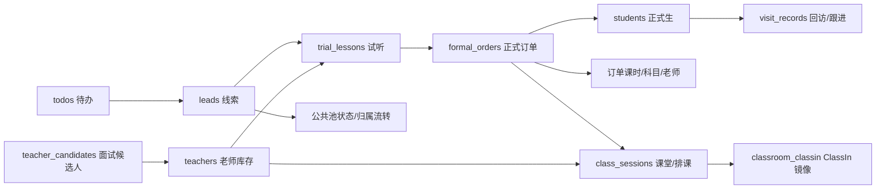

# 小牛好学 2026-06-16 交付验收包

本文件用于黄老师团队复测和交接。它只记录可复核的信息，不包含密钥、Token、密码或第三方后台敏感值。

## 1. 环境与部署

| 项目 | 当前值 |
|---|---|
| 主域名 | `https://xiaoniuhaoxue.paitongai.cn` |
| Vercel 项目 | `xiaoniuhaoxue-next` |
| 最新生产部署 | `https://xiaoniuhaoxue-next-kfbdbkna6-328590885s-projects.vercel.app` |
| 当前本地分支 | `feat/teacher-detail-students` |
| 当前本地基准 commit | `46c6f0f777aee782464b6b3751668867d5c50844` |
| 技术栈 | Next.js 16、React 19、TypeScript、Tailwind CSS、Supabase、Vercel、ClassIn |
| 线上健康检查 | `GET /api/health` |
| 主要验收清单 | `docs/verifiable-issue-checklist-2026-06-16.md` |

注意：本地工作区目前存在未提交变更。正式发版前应确认部署版本对应的 diff，合入目标分支并打发布标记。

## 2. 已完成自动化验收

| 验收报告 | 覆盖范围 | 结果 |
|---|---|---|
| `.gstack/qa-reports/online-api-auth-matrix-2026-06-16.md` | 86 个接口路由、145 个方法、615 个认证/权限用例 | 0 失败 |
| `.gstack/qa-reports/online-ui-role-coverage-2026-06-16-UI-M849MX.md` | 运营、销售、班主任、教务、管理员页面覆盖 | 93/93 通过 |
| `.gstack/qa-reports/online-business-flow-acceptance-2026-06-16.md` | 线索、公共池、试听、转正式、待办、上传闭环 | 26/26 通过 |
| `.gstack/qa-reports/online-deep-acceptance-2026-06-16.md` | 正式订单、面试、老师入库、课堂导出、权限边界 | 26/26 通过 |
| `.gstack/qa-reports/online-release-regression-2026-06-16.md` | 发布回归 | 65/65 通过 |
| `.gstack/qa-reports/online-gap-acceptance-2026-06-16.md` | 重点缺口回归 | 34/35 自动通过，1 项 ClassIn 外部核验 |

## 3. 模块级修改清单

| 模块 | 影响页面 | 关键接口 | 测试入口 |
|---|---|---|---|
| 登录与会话 | `/auth/signin`、`/dashboard` | `/api/auth/signin`、`/api/auth/profile`、`/api/auth/session`、`/api/auth/signout` | API 权限矩阵、5 角色 UI 覆盖 |
| 线索管理 | `/dashboard/leads`、`/dashboard/leads/new`、`/dashboard/leads/[id]` | `/api/leads`、`/api/leads/[id]`、`/api/leads/[id]/feedback` | 业务闭环、缺口验收 |
| 公共线索池 | `/dashboard/public-leads` | `/api/public-leads`、`/api/public-leads/[id]/grab` | 业务闭环 |
| 试听课程 | `/dashboard/trial-lessons`、`/dashboard/trial-lessons/new`、`/dashboard/trial-lessons/[id]` | `/api/trial-lessons`、`/api/trial-lessons/[id]`、`/api/trial-lessons/[id]/confirm-teacher`、`/api/trial-lessons/[id]/create-classin-course` | 业务闭环、缺口验收 |
| 正式订单 | `/dashboard/formal-orders`、`/dashboard/formal-orders/new`、`/dashboard/formal-orders/[id]` | `/api/formal-orders`、`/api/formal-orders/[id]`、`/api/formal-orders/[id]/convert-from-trial` | 深度验收、缺口验收 |
| 正式生/学生 | `/dashboard/students`、`/dashboard/students/[id]` | `/api/students`、`/api/students/[id]`、`/api/students/[id]/visit-records` | 缺口验收、UI 覆盖 |
| 排课与课堂 | `/dashboard/schedules`、`/dashboard/class-sessions`、`/dashboard/formal-orders/[id]/schedule` | `/api/schedule/batch/precheck`、`/api/schedule/batch/create-classin`、`/api/class-sessions`、`/api/class-sessions/export` | 缺口验收、深度验收 |
| 老师与招师 | `/dashboard/teachers`、`/dashboard/teacher-candidates`、公开采集页 | `/api/teachers`、`/api/teacher-candidates`、`/api/teacher-info-forms/*` | 深度验收、缺口验收 |
| 待办/回访 | `/dashboard/todos`、`/dashboard/feedback`、学生详情回访区 | `/api/todos`、`/api/feedback`、`/api/visit-records` | 业务闭环、缺口验收 |
| 文件上传 | 线索截图、试听付款凭证、老师/面试资料入口 | `/api/upload/sign` | 业务闭环 |
| 权限矩阵 | 侧边栏、按钮、直访页面、API | 全部受保护 API | API 权限矩阵、UI 角色覆盖 |

## 4. 核心数据关系

核心业务链路是：线索创建后进入销售/班主任跟进；有效线索创建试听；试听确认老师并同步 ClassIn；试听转正式订单；正式订单生成正式学生、课时、排课和课堂记录；课堂记录可同步 ClassIn；学生详情承接回访、续费、扩科、退费等正式生操作。



已存在的详细表结构和线上表清单：

| 文档 | 用途 |
|---|---|
| `docs/database-design.md` | 核心业务表设计 |
| `docs/current-tables.md` | 当前数据库表盘点 |
| `docs/online-tables.md` | 线上实际表、服务和 API 映射 |
| `docs/CLASSIN_CLASSROOM_MANAGEMENT.md` | ClassIn 课堂/教室管理关系与接口 |

## 5. 关键 API 示例

以下示例省略真实认证信息。除登录接口外，受保护接口统一携带：

```http
Authorization: Bearer <access_token>
Content-Type: application/json
```

### 登录

```http
POST /api/auth/signin

{
  "username": "xs001",
  "password": "<password>"
}
```

成功后返回用户档案、角色和会话信息，并写入认证 Cookie。

### 创建线索

```http
POST /api/leads

{
  "entry_date": "2026-06-16",
  "xhs_source": "parent_account",
  "channel_platform": "抖音",
  "customer_social_id": "social-id-001",
  "add_method_code": "yaojiazhang_v",
  "grade_code": "p3",
  "subject_codes": ["math"],
  "region_ip": "beijing",
  "parent_wechat": "parent-wechat"
}
```

运营、销售、班主任可按数据范围创建；教务不可创建。线索编号由服务端生成，销售/班主任只能归属自己。

### 公共池抢单

```http
POST /api/public-leads/<lead_id>/grab
```

抢单前敏感字段脱敏；抢单后归属当前销售或班主任，敏感字段按权限可见。

### 创建试听

```http
POST /api/trial-lessons

{
  "lead_id": "<lead_id>",
  "teacher_id": "<teacher_id>",
  "student_name": "测试学生",
  "parent_phone": "13800000000",
  "scheduled_at": "2026-06-20T10:00:00+08:00",
  "payment_proof_url": "https://..."
}
```

必须关联可访问线索或既有正式学生；老师必须来自老师库；付款凭证通过签名上传获得 URL。

### 试听转正式订单

```http
POST /api/formal-orders

{
  "trial_lesson_id": "<trial_lesson_id>",
  "order_type": "new",
  "total_amount": 10000,
  "total_hours": 40
}
```

服务端关联试听和学生，重复转正式会被拒绝。

### 学生详情与回访

```http
GET /api/students/<student_id>
POST /api/students/<student_id>/visit-records
```

班主任只访问自己负责学生；销售只访问自己相关学生；教务和管理员按权限访问。

### 批量排课与 ClassIn

```http
POST /api/schedule/batch/precheck
POST /api/schedule/batch/create-classin
PUT /api/class-sessions/<session_id>
```

排课接口校验订单、老师范围和 ClassIn 绑定状态；修改课堂时间时，若课堂已绑定 ClassIn 教室，会尝试同步 ClassIn 并记录同步状态。

### 老师候选人与入库

```http
POST /api/teacher-candidates
POST /api/teacher-candidates/<id>/interview-sessions
POST /api/teacher-candidates/<id>/hire
```

管理员/教务/招师按权限处理候选人、面试、评价和入库；销售等无关角色不可访问候选人敏感数据。

### 上传签名

```http
POST /api/upload/sign

{
  "fileName": "付款凭证.png",
  "contentType": "image/png",
  "fileSize": 10485760,
  "category": "payment-proof"
}
```

成功后返回签名上传目标；超限或不支持格式会返回明确错误。

### 待办

```http
POST /api/todos

{
  "assigned_to": "<operator_id>",
  "title": "协助处理线索",
  "entity_type": "lead",
  "entity_id": "<lead_id>",
  "priority": "high"
}
```

销售可在允许线索范围内触发催促流程；不能伪造无权线索待办。

## 6. 权限与数据范围

| 角色 | 主要能力 | 主要限制 |
|---|---|---|
| 运营 | 创建并管理自己录入线索；处理销售催促待办 | 不访问回访管理；不能查看其他运营线索敏感信息 |
| 销售 | 跟进自己线索；抢公共池；创建线索、试听、转正式；查看自己相关订单/学生 | 不能编辑正式订单核心财务字段；不能越权查看他人敏感数据 |
| 班主任 | 管理自己学生、回访、部分线索和正式生流程 | 只能看到分配给自己的学生、订单、课堂 |
| 教务 | 老师库存、课堂、排课、面试复核、导出等教务流程 | 不创建线索；按权限访问业务数据 |
| 招师 | 面试管理、候选人资料、初评、信息采集和入库前流程 | 仅显示“教务管理 > 面试管理”；销售、试听、正式课、学生、排课、账号、老师库存等页面直访受限 |
| 管理员 | 全量后台管理和发布验收支持 | 删除等危险操作仍按接口权限控制 |

详细权限、页面和接口矩阵见 `docs/api-page-permission-map-2026-06-15.md` 与 `docs/role-permissions.md`。

## 7. 技术栈与第三方服务

| 类别 | 内容 |
|---|---|
| 前端 | Next.js App Router、React、TypeScript、Tailwind CSS、Radix UI、lucide-react |
| 后端 | Next.js Route Handlers、Supabase JS、服务端权限校验 |
| 数据库 | Supabase Postgres |
| 存储 | Supabase Storage 签名直传 |
| 部署 | Vercel |
| 第三方教学系统 | ClassIn API，用于学生、老师、课程/课堂同步 |
| 自动化测试 | Playwright、线上 API/页面覆盖脚本 |

## 8. 环境变量清单

| 变量 | 用途 | 配置位置 | 敏感 |
|---|---|---|---|
| `NEXT_PUBLIC_SUPABASE_URL` | Supabase 项目 URL | Vercel、`.env.local` | 否 |
| `NEXT_PUBLIC_SUPABASE_ANON_KEY` | Supabase 前端匿名 Key | Vercel、`.env.local` | 是 |
| `SUPABASE_SERVICE_ROLE_KEY` | 服务端管理权限 Key | Vercel、`.env.local` | 是 |
| `NEXT_PUBLIC_APP_URL` | 应用公开访问地址 | Vercel、`.env.local` | 否 |
| `CLASSIN_SID` | ClassIn 服务 SID | Vercel、`.env.local` | 是 |
| `CLASSIN_SECRET` | ClassIn 服务密钥 | Vercel、`.env.local` | 是 |
| `CLASSIN_API_URL` | ClassIn 服务端 API 地址 | Vercel、`.env.local` | 否 |
| `NEXT_PUBLIC_CLASSIN_API_URL` | ClassIn 前端展示/跳转相关地址 | Vercel、`.env.local` | 否 |
| `NEXT_PUBLIC_CLASSIN_CONSOLE_URL` | ClassIn 控制台地址 | Vercel、`.env.local` | 否 |
| `XNHX_BASE_URL` / `BASE_URL` | 自动化测试目标地址 | 本地测试环境 | 否 |
| `XNHX_OPERATOR_PASSWORD`、`XNHX_SALES_PASSWORD`、`XNHX_HEAD_TEACHER_PASSWORD`、`XNHX_ACADEMIC_AFFAIRS_PASSWORD`、`XNHX_ADMIN_PASSWORD` | 线上自动化测试账号密码 | 本地测试环境 | 是 |
| `SUPABASE_DB_URL` / `DATABASE_URL` | 发布审计和 RLS 检查数据库连接 | 本地/CI 发布环境 | 是 |
| `XNHX_QA_REPORT_DIR`、`XNHX_REPORT_STAMP`、`XNHX_UI_HEADLESS`、`XNHX_BROWSER_CHANNEL` | 自动化报告和浏览器配置 | 本地测试环境 | 否 |

基础示例见 `.env.example` 和 `.env.local.example`。真实值只应保存在 Vercel 环境变量、Supabase 控制台或本地私有 `.env.local`，不要写入仓库。

## 9. 本地快速启动

```bash
npm install
cp .env.example .env.local
# 按第 8 节补齐 Supabase、ClassIn 和 APP URL 等变量
npm run dev
```

基础验证：

```bash
npm run audit:routes
npm run build
```

线上验收脚本运行前需要配置测试账号密码环境变量，再执行对应脚本或 npm 命令。已归档报告在 `.gstack/qa-reports/`。

## 10. 当前遗留与阻塞

| ID | 状态 | 影响 | 下一步 |
|---|---|---|---|
| LN-023 | 已关闭 | 2026-06-17 已用线上招师账号完成专项验收；UI 24/24 通过，API 270/270 通过 | 证据：`.gstack/qa-reports/online-ui-role-coverage-2026-06-17-UI-1NJ8GW.md`、`.gstack/qa-reports/online-api-auth-matrix-2026-06-17-teacher-recruiter.md` |
| ST-011 | 阻塞 | ClassIn 后台是否真实含学生、老师、课节需要第三方后台或官方查询接口确认 | 用 ClassIn 控制台核对自动化生成的课堂，或补 ClassIn 查询 API 验收 |
| ST-021 | 阻塞 | 修改课节时间后的 ClassIn 外部同步需要真实 ClassIn 课堂查询确认 | 选择已绑定 ClassIn 的课节修改时间，查询 ClassIn 控制台/接口核对 |
| 发布 RLS 审计 | 待复核 | 2026-06-13 发布门禁历史报告显示 RLS 审计阻塞 | 若数据库 SQL 已执行，重新运行 `npm run release:after-db` 或对应 release gate |
